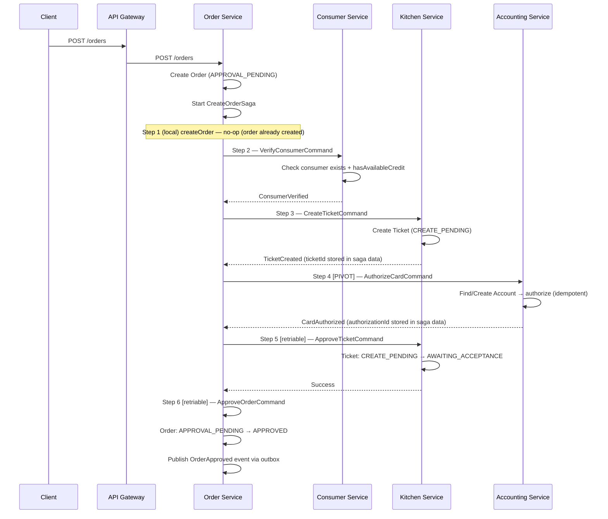
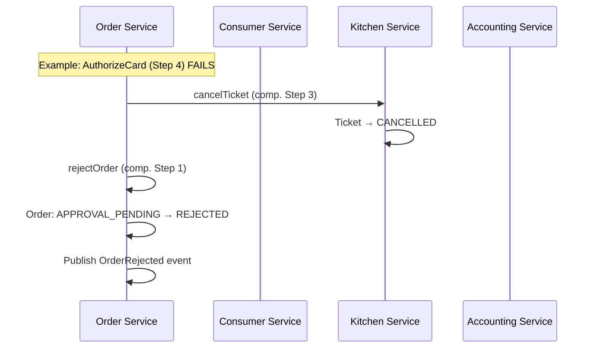
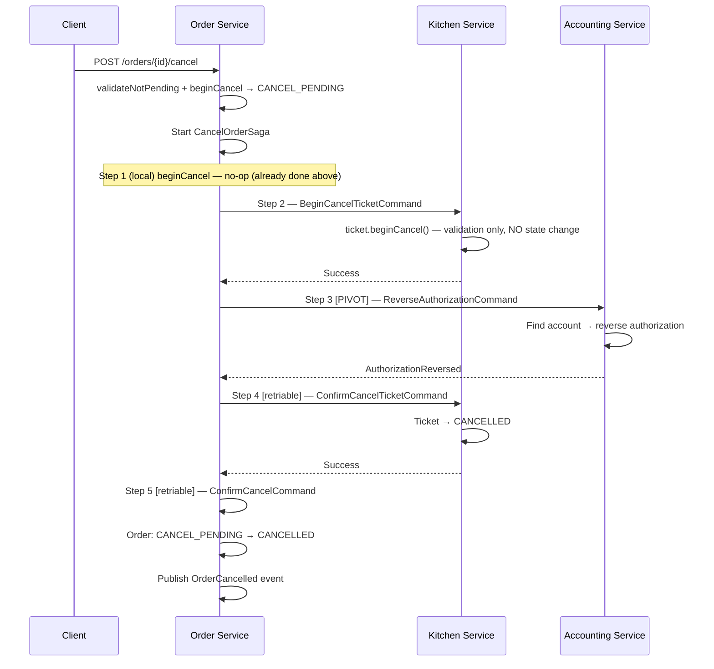
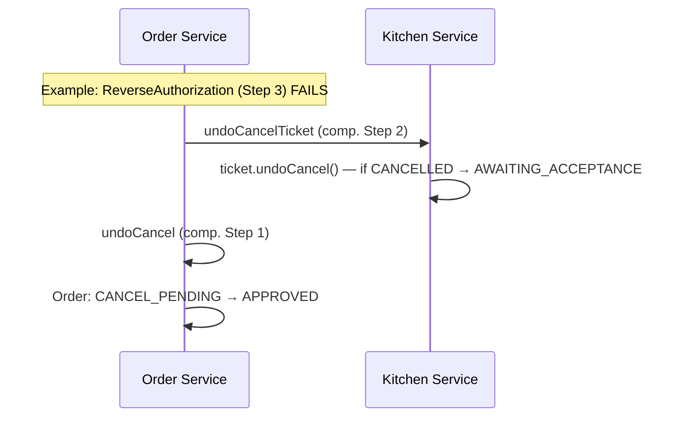
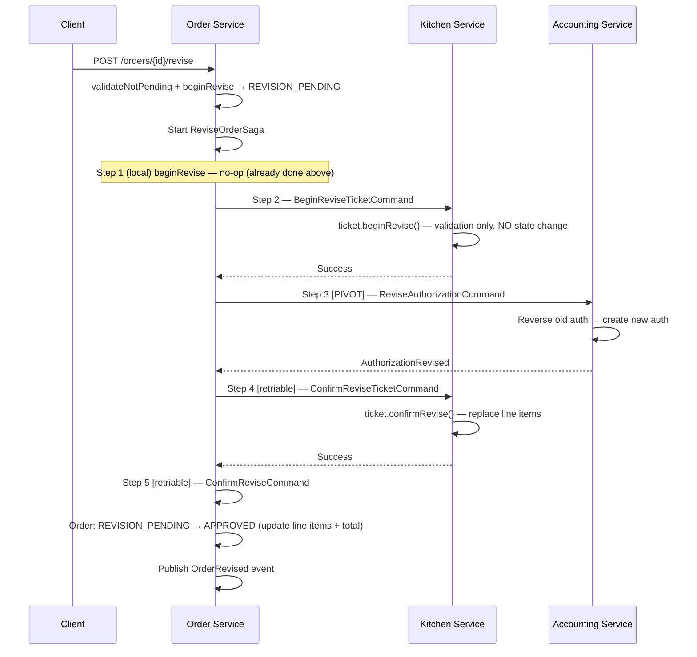

# FTGO Service Flow Review & Issue Analysis

## 1. Services Overview (8 services reviewed)

| # | Service | Key Aggregate | Role |
|---|---------|---------------|------|
| 1 | **API Gateway** | — | Entry point, JWT auth, API composition, circuit breaker |
| 2 | **Order Service** ⭐ | `Order` | Core orchestrator, owns all 3 sagas |
| 3 | **Consumer Service** | `Consumer` | Credit verification saga participant |
| 4 | **Restaurant Service** | `Restaurant`, `MenuItem` | Menu management, domain events |
| 5 | **Kitchen Service** | `Ticket` | Ticket lifecycle saga participant |
| 6 | **Accounting Service** | `Account`, `Authorization` | Payment authorization, pivot point |
| 7 | **Delivery Service** | `Delivery`, `Courier` | Delivery lifecycle |
| 8 | **Order History Service** | `OrderHistoryRecord` | CQRS read model, event consumer |

---

## 2. Flow Analysis: Create Order (Happy Path)



### Create Order — Compensation Flow (Failure before pivot)



---

## 3. Flow Analysis: Cancel Order (Happy Path)



### Cancel Order — Compensation Flow (Failure before pivot)



---

## 4. Flow Analysis: Revise Order (Happy Path)



---

## 5. Issues Found

### 🔴 CRITICAL Issues

---

#### Issue #1: CancelOrderSaga passes `null` ticketId and authorizationId — NPE at runtime

**Location**: [OrderService.java:158-162](file:///home/vht/project/ftgo/order-service/src/main/java/net/ftgo/order/service/OrderService.java#L158-L162)

```java
CancelOrderSagaData sagaData = new CancelOrderSagaData(
    order.getId(),
    null, // ticketId - to be retrieved from CreateOrderSaga instance
    null  // authorizationId - to be retrieved from CreateOrderSaga instance
);
```

**Impact**: When the CancelOrderSaga reaches Step 2 (`beginCancelTicket`), it sends `BeginCancelTicketCommand(null)` to Kitchen Service. The Kitchen handler calls `ticketRepository.findById(null)` which either throws an exception or returns empty, causing the saga to fail with a cryptic error.

Similarly, Step 3 (`reverseAuthorization`) sends `ReverseAuthorizationCommand(null)` to Accounting Service.

**The same problem exists in `reviseOrder()`** — [OrderService.java:210-215](file:///home/vht/project/ftgo/order-service/src/main/java/net/ftgo/order/service/OrderService.java#L210-L215) also passes `null` for `ticketId` and `authorizationId`.

**Root Cause**: The `ticketId` and `authorizationId` are only known after the CreateOrderSaga completes (they're stored in `CreateOrderSagaData`), but the Order aggregate doesn't persist these values. They need to be stored on the Order entity or looked up from saga instance storage.

**Fix**: Add `ticketId` (Long) and `authorizationId` (String) columns to the `orders` table. Populate them during the `approveOrder` step of CreateOrderSaga. Read them back when initiating Cancel/Revise sagas.

---

#### Issue #2: Type mismatch between saga commands and accounting service handler commands

**Location**:
- Saga side: [ReverseAuthorizationCommand.java (order-service)](file:///home/vht/project/ftgo/order-service/src/main/java/net/ftgo/order/saga/commands/ReverseAuthorizationCommand.java) — `authorizationId` is `String`
- Handler side: [ReverseAuthorizationCommand.java (accounting-service)](file:///home/vht/project/ftgo/accounting-service/src/main/java/net/ftgo/accounting/messaging/ReverseAuthorizationCommand.java) — `authorizationId` is `Long`

The saga sends `authorizationId` as `String`. The Accounting Service handler expects `Long`. JSON deserialization **may silently fail** or throw a type mismatch, causing the pivot step of CancelOrderSaga to fail.

The same problem exists for:
- `ReviseAuthorizationCommand`: saga sends `authorizationId` as `String`, handler expects `Long`
- `ReverseAuthorizationCommand`: saga version has **no `consumerId` field**, but the handler version requires `consumerId`
- `ReviseAuthorizationCommand`: saga version has **no `consumerId` field**, but the handler version requires `consumerId`

**Fix**: Unify the command classes into a single shared module (`common`), or ensure both sides have identical field names and types.

---

#### Issue #3: Duplicate command classes across modules — deserialization will use wrong class

**Location**: Commands like `ReverseAuthorizationCommand`, `ReviseAuthorizationCommand`, `AuthorizeCardCommand` exist in **both**:
- `net.ftgo.order.saga.commands.*` (order-service)
- `net.ftgo.accounting.messaging.*` (accounting-service)

These are **different classes with different field structures**. Eventuate Tram serializes by class name. At deserialization time, the accounting service will attempt to deserialize into its own `ReverseAuthorizationCommand` which has `consumerId` + `authorizationId: Long`, but the saga sent a message serialized from the order-service version which has only `authorizationId: String`.

**Impact**: Fields like `consumerId` will be `null` on the handler side, leading to `Account not found for consumer null`.

**Fix**: Share command classes via the `common` module, or ensure the class FQDNs and field structures are identical.

---

#### Issue #4: CancelOrderSaga `beginCancel` local step is a no-op — double state transition

**Location**:
- [OrderService.cancelOrder()](file:///home/vht/project/ftgo/order-service/src/main/java/net/ftgo/order/service/OrderService.java#L140-L168): Calls `order.beginCancel()` **before** starting the saga
- [CancelOrderSagaLocalSteps.beginCancel()](file:///home/vht/project/ftgo/order-service/src/main/java/net/ftgo/order/saga/CancelOrderSagaLocalSteps.java#L88-L105): The saga's Step 1 also calls `order.beginCancel()`

The Order is already in `CANCEL_PENDING` when the saga starts. The saga's local Step 1 handler calls `beginCancel()` **again**, which throws `IllegalStateException("Cannot cancel order in state CANCEL_PENDING. Expected APPROVED.")` — crashing the saga immediately.

The same issue exists for ReviseOrderSaga: `OrderService.reviseOrder()` calls `order.beginRevise()` before starting the saga, and `ReviseOrderSagaLocalSteps.beginRevise()` calls it again.

**Fix**: Either:
1. Remove the `beginCancel()`/`beginRevise()` call from `OrderService` and let the saga's local step handle it, OR
2. Make the saga's local step a no-op (don't call `beginCancel()` again), which is what the `CancelOrderSaga.beginCancel()` method comment says it does, but `CancelOrderSagaLocalSteps` contradicts this.

---

### 🟠 MAJOR Issues

---

#### Issue #5: Ticket `beginCancel()` does NOT set a CANCEL_PENDING state — no semantic lock

**Location**: [Ticket.java:189-195](file:///home/vht/project/ftgo/kitchen-service/src/main/java/net/ftgo/kitchen/domain/Ticket.java#L189-L195)

```java
public void beginCancel() {
    if (state == TicketState.CANCELLED) {
        throw new IllegalStateException("Ticket is already cancelled");
    }
    // In a full implementation, this might set a CANCEL_PENDING state
}
```

The method validates the ticket isn't already cancelled but **doesn't actually change state**. This means:
- There's no semantic lock on the Ticket during cancellation
- Concurrent operations (e.g., restaurant accepts the ticket while cancel is in progress) are not blocked
- `undoCancel()` checks `if (state == TicketState.CANCELLED)` but since `beginCancel()` never sets CANCELLED, the undo is a no-op when the cancellation compensation fires before `confirmCancel()`.

**Fix**: Add `CANCEL_PENDING` to `TicketState` enum and set it in `beginCancel()`. Update `undoCancel()` to restore from `CANCEL_PENDING` to the previous state.

---

#### Issue #6: Ticket `undoCancel()` hardcodes restoration to `AWAITING_ACCEPTANCE` — data loss

**Location**: [Ticket.java:208-214](file:///home/vht/project/ftgo/kitchen-service/src/main/java/net/ftgo/kitchen/domain/Ticket.java#L208-L214)

```java
public void undoCancel() {
    if (state == TicketState.CANCELLED) {
        this.state = TicketState.AWAITING_ACCEPTANCE;
    }
}
```

If the ticket was in `ACCEPTED`, `PREPARING`, or `READY_FOR_PICKUP` state before cancellation began, the undo always restores to `AWAITING_ACCEPTANCE`, losing the ticket's actual progress. A kitchen that was mid-preparation would appear to restart from scratch.

**Fix**: Store the previous state before cancellation and restore it during undo.

---

#### Issue #7: Delivery Service is NOT integrated into any saga

**Location**: Architecture plan specifies Delivery Service as a saga participant, and `ChannelNames.DELIVERY_SERVICE_COMMAND_CHANNEL` exists, but:
- Neither `CreateOrderSaga` nor `CancelOrderSaga` sends any command to Delivery Service
- There is no `DeliveryServiceCommandHandlers` class
- The Delivery Service has no Kafka command handler — it only provides REST endpoints

**Impact**: After order approval, no delivery is automatically created. The delivery lifecycle is completely disconnected from the order saga.

**Fix**: Add a retriable Step 7 in `CreateOrderSaga` that sends a `CreateDeliveryCommand` to Delivery Service after order approval. Add corresponding command handler in Delivery Service.

---

#### Issue #8: Consumer credit is verified but never reserved — no isolation

**Location**: [ConsumerCommandHandlers.java:63](file:///home/vht/project/ftgo/consumer-service/src/main/java/net/ftgo/consumer/messaging/ConsumerCommandHandlers.java#L63)

```java
boolean verified = consumerService.verifyConsumerCredit(
    command.getConsumerId(), orderTotal
);
```

And [ConsumerService.verifyConsumerCredit()](file:///home/vht/project/ftgo/consumer-service/src/main/java/net/ftgo/consumer/service/ConsumerService.java#L52-L57):

```java
public boolean verifyConsumerCredit(Long consumerId, Money orderTotal) {
    return consumerRepository.findById(consumerId)
        .map(consumer -> consumer.hasAvailableCredit(orderTotal))
        .orElse(false);
}
```

This is a **read-only check** — credit is never actually reserved. Between verification and payment authorization, the consumer could place multiple concurrent orders that all pass verification but exceed the credit limit.

The `Consumer` entity has `reserveCredit()` and `releaseCredit()` methods, but they are never called during the saga.

**Fix**: The `verifyConsumer` step should call `consumer.reserveCredit(orderTotal)`. Add a compensation step to call `consumer.releaseCredit(orderTotal)` if the saga fails.

---

#### Issue #9: `OrderApproved` event is published with null ticketId and authorizationId

**Location**: [CreateOrderSagaLocalSteps.java:151-157](file:///home/vht/project/ftgo/order-service/src/main/java/net/ftgo/order/saga/CreateOrderSagaLocalSteps.java#L151-L157)

```java
OrderApproved event = new OrderApproved(
    order.getId(),
    order.getConsumerId(),
    order.getRestaurantId(),
    order.getOrderTotal(),
    null, // ticketId from saga data
    null  // authorizationId from saga data
);
```

The Order History Service and other consumers of the `OrderApproved` event will have no way to correlate the order with its ticket or authorization.

**Fix**: The local step command handler needs access to saga data (ticketId, authorizationId). Pass them through the `ApproveOrderCommand` or store on the Order entity.

---

### 🟡 MODERATE Issues

---

#### Issue #10: `Ticket.beginRevise()` does not set a REVISION_PENDING state

**Location**: [Ticket.java:221-230](file:///home/vht/project/ftgo/kitchen-service/src/main/java/net/ftgo/kitchen/domain/Ticket.java#L221-L230)

Same pattern as Issue #5 — validates but doesn't actually lock. Concurrent ticket acceptance could race with revision.

---

#### Issue #11: Ticket `undoRevise()` requires `originalLineItems` parameter but the saga doesn't track them

**Location**: [Ticket.java:250-254](file:///home/vht/project/ftgo/kitchen-service/src/main/java/net/ftgo/kitchen/domain/Ticket.java#L250-L254)

The `UndoReviseTicketCommand` in [KitchenServiceCommandHandlers.java:399](file:///home/vht/project/ftgo/kitchen-service/src/main/java/net/ftgo/kitchen/messaging/KitchenServiceCommandHandlers.java#L399) calls `command.getOriginalLineItems()`, but the saga's `ReviseOrderSagaData` doesn't store original line items — it only stores `revisedLineItems`.

**Impact**: The undo will fail with null or empty original line items.

---

#### Issue #12: `AccountingServiceCommandHandlers` methods are `private` but annotated with `@Transactional`

**Location**: [AccountingServiceCommandHandlers.java:71](file:///home/vht/project/ftgo/accounting-service/src/main/java/net/ftgo/accounting/messaging/AccountingServiceCommandHandlers.java#L71), [line 129](file:///home/vht/project/ftgo/accounting-service/src/main/java/net/ftgo/accounting/messaging/AccountingServiceCommandHandlers.java#L129), [line 186](file:///home/vht/project/ftgo/accounting-service/src/main/java/net/ftgo/accounting/messaging/AccountingServiceCommandHandlers.java#L186)

```java
@Transactional
private Message handleAuthorizeCard(...) { ... }
```

Spring AOP proxies cannot intercept `private` methods. The `@Transactional` annotation is silently ignored, meaning all database operations (account creation, authorization creation, reversal) execute **without a transaction boundary**. If a partial failure occurs (e.g., account saved but authorization not), the data will be inconsistent.

**Fix**: Change method visibility to `public` (or at least `package-private`).

---

#### Issue #13: `OrderHistoryEventHandlers.handleOrderEvent()` NullPointerException on switch

**Location**: [OrderHistoryEventHandlers.java:93](file:///home/vht/project/ftgo/order-history-service/src/main/java/net/ftgo/orderhistory/messaging/OrderHistoryEventHandlers.java#L93)

```java
switch (eventType) {  // eventType can still be null here
```

If the event payload doesn't match the heuristic inference at lines 83-91, `eventType` remains `null`, and `switch(null)` throws `NullPointerException` in Java.

**Fix**: Add a null check before the switch, or use a default value.

---

#### Issue #14: `OrderService.cancelOrder()` calls both `validateNotPending()` and `beginCancel()` — redundant check

**Location**: [OrderService.java:147-150](file:///home/vht/project/ftgo/order-service/src/main/java/net/ftgo/order/service/OrderService.java#L147-L150)

```java
order.validateNotPending();     // Throws if any pending state
order.beginCancel();            // Throws if state != APPROVED
```

`validateNotPending()` rejects CANCEL_PENDING, REVISION_PENDING, and APPROVAL_PENDING. But `beginCancel()` already rejects everything except APPROVED. The only difference is the error message. However, a `REJECTED` order passes `validateNotPending()` but fails `beginCancel()` — this is correct behavior but could be confusing for debugging.

This is a minor issue but indicates the validation layers are not cleanly separated.

---

## 6. Summary of Issues by Severity

| Severity | # | Issue Summary |
|----------|---|---------------|
| 🔴 CRITICAL | 1 | `null` ticketId/authorizationId in Cancel/Revise saga data → NPE |
| 🔴 CRITICAL | 2 | Type mismatch `String` vs `Long` for authorizationId between saga and handler |
| 🔴 CRITICAL | 3 | Duplicate command classes with incompatible fields → deserialization failure |
| 🔴 CRITICAL | 4 | Double `beginCancel()`/`beginRevise()` call → `IllegalStateException` crash |
| 🟠 MAJOR | 5 | Ticket `beginCancel()` is a no-op — no semantic lock on Kitchen side |
| 🟠 MAJOR | 6 | Ticket `undoCancel()` hardcodes `AWAITING_ACCEPTANCE` — wrong state restore |
| 🟠 MAJOR | 7 | Delivery Service not integrated into any saga — disconnected lifecycle |
| 🟠 MAJOR | 8 | Consumer credit verified but never reserved — concurrent order race condition |
| 🟠 MAJOR | 9 | `OrderApproved` event has null ticketId/authorizationId — broken event data |
| 🟡 MODERATE | 10 | Ticket `beginRevise()` is a no-op — no semantic lock on Kitchen side |
| 🟡 MODERATE | 11 | `undoRevise()` requires original line items but saga doesn't track them |
| 🟡 MODERATE | 12 | `@Transactional` on `private` methods in AccountingServiceCommandHandlers — silently ignored |
| 🟡 MODERATE | 13 | `switch(null)` in OrderHistoryEventHandlers → NPE |
| 🟡 MODERATE | 14 | Redundant pending validation in OrderService |

---

## 7. Recommended Fix Priority

> [!IMPORTANT]
> Issues #1, #2, #3, and #4 are **blocking issues** that prevent the Cancel and Revise sagas from working at all. They should be fixed first.

### Phase 1 — Unblock Cancel/Revise Sagas
1. **Fix #4**: Remove duplicate `beginCancel()`/`beginRevise()` calls from `OrderService` (let saga handle it)
2. **Fix #1**: Add `ticketId` and `authorizationId` to Order entity; populate during `approveOrder` step
3. **Fix #2+#3**: Unify command classes into the `common` module with consistent field types

### Phase 2 — Correctness & Data Integrity
4. **Fix #12**: Change `private` → `public` on accounting command handler methods
5. **Fix #8**: Change `verifyConsumerCredit()` to `reserveCredit()` with compensation
6. **Fix #5+#10**: Add `CANCEL_PENDING`/`REVISION_PENDING` states to `TicketState`
7. **Fix #6**: Store previous ticket state for proper undo
8. **Fix #11**: Store original line items in `ReviseOrderSagaData` for undo
9. **Fix #9**: Pass ticketId/authorizationId through `ApproveOrderCommand`
10. **Fix #13**: Add null guard before switch in `OrderHistoryEventHandlers`

### Phase 3 — Architecture Completeness
11. **Fix #7**: Integrate Delivery Service into sagas
12. **Fix #14**: Clean up redundant validation

## Open Questions

> [!IMPORTANT]
> 1. Should the command classes be unified into the `common` module, or should a contract-first approach (shared proto/avro schemas) be used instead?
> 2. For the Delivery Service integration, should delivery creation happen as part of the CreateOrderSaga (retriable step after approval), or as a separate choreography triggered by the `OrderApproved` event?
> 3. Should the `Consumer.reserveCredit()` step be compensatable (with `releaseCredit()` as compensation), or should it remain read-only and rely on the Accounting Service for financial isolation?
