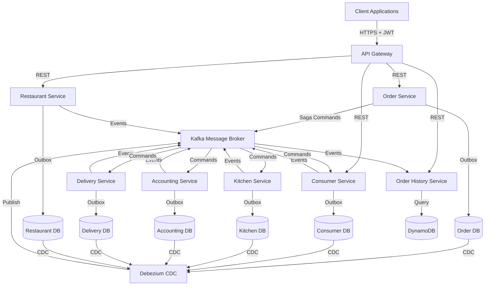
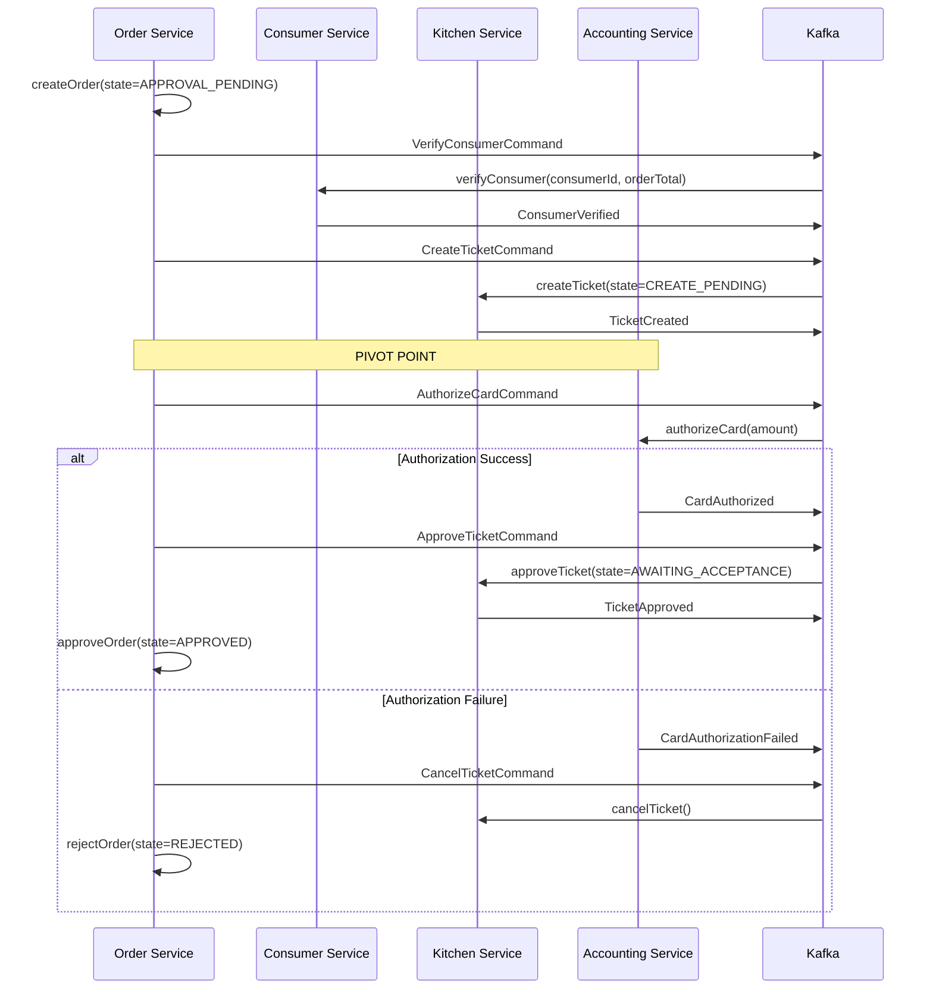

# Design Document: FTGO Microservices Platform

## Overview

The FTGO (Food To Go) platform is a production-grade, event-driven microservices system for food ordering and delivery. The system implements distributed transaction management using saga orchestration patterns, ensuring data consistency across 8 independent microservices without distributed transactions. The architecture leverages the Transactional Outbox pattern with Debezium CDC for reliable event publishing, CQRS for scalable read operations, and Kafka for asynchronous messaging.

### Key Design Principles

1. **Database-per-Service**: Each microservice owns its data and schema, enabling independent deployment and technology choices
2. **Saga Orchestration**: Order Service acts as the central orchestrator for distributed transactions, coordinating CreateOrder, CancelOrder, and ReviseOrder workflows
3. **Event-Driven Architecture**: Services communicate primarily through domain events published to Kafka, enabling loose coupling and eventual consistency
4. **Transactional Messaging**: The Transactional Outbox pattern with Debezium CDC ensures atomic database updates and event publishing
5. **CQRS Separation**: Order History Service maintains a denormalized read model optimized for query patterns, separate from the write-optimized Order Service
6. **Semantic Locking**: Pending states (APPROVAL_PENDING, CANCEL_PENDING, REVISION_PENDING) prevent concurrent modifications during saga execution

### Technology Stack

- **Application Framework**: Spring Boot 3.2 with Java 21
- **Saga Framework**: [Eventuate Tram Sagas](https://eventuate.io/docs/manual/eventuate-tram/latest/getting-started-eventuate-tram-sagas.html) for orchestration-based saga coordination
- **Messaging**: Apache Kafka 3.x for event streaming and command channels
- **CDC**: [Debezium](https://debezium.io/) for change data capture from MySQL binlog to Kafka
- **Databases**: MySQL 8 (per service), DynamoDB for CQRS read model
- **Orchestration**: Kubernetes with Istio service mesh
- **Observability**: Jaeger (tracing), Prometheus (metrics), ELK Stack (logging)

## Architecture

### System Context



### Service Responsibilities

| Service | Responsibility | Database | Communication Pattern |
|---------|---------------|----------|----------------------|
| **API Gateway** | Authentication, routing, rate limiting, API composition | Redis | Synchronous REST to downstream services |
| **Order Service** | Order lifecycle management, saga orchestration | MySQL (orders) | Orchestrates sagas via Kafka command channels |
| **Consumer Service** | Consumer account management, credit verification | MySQL (consumers) | Saga participant, publishes domain events |
| **Restaurant Service** | Restaurant profiles, menu management | MySQL (restaurants) | Publishes domain events for menu changes |
| **Kitchen Service** | Kitchen ticket management, preparation tracking | MySQL (tickets) | Saga participant, publishes ticket lifecycle events |
| **Accounting Service** | Payment authorization, transaction management | MySQL (accounts) | Saga participant (pivot point), publishes authorization events |
| **Delivery Service** | Courier assignment, delivery tracking | MySQL (deliveries) | Consumes order events, publishes delivery status |
| **Order History Service** | CQRS read model for order queries | DynamoDB | Consumes all order-related events, provides query API |

### Saga Orchestration Pattern

The system uses **orchestration-based sagas** implemented with [Eventuate Tram Sagas framework](https://eventuate.io/docs/manual/eventuate-tram/latest/getting-started-eventuate-tram-sagas.html). The Order Service acts as the saga orchestrator, coordinating distributed transactions across multiple services.

**Key Saga Concepts:**

- **Compensatable Steps**: Steps that can be undone if the saga fails (e.g., createTicket → cancelTicket)
- **Pivot Point**: The first non-compensatable step (typically payment authorization). Once the pivot succeeds, the saga must complete forward
- **Retriable Steps**: Steps after the pivot that must eventually succeed (e.g., approveOrder)
- **Semantic Lock**: Using pending states (APPROVAL_PENDING) to prevent concurrent modifications during saga execution

**CreateOrderSaga Flow:**



### Transactional Outbox Pattern

The [Transactional Outbox pattern](https://microservices.io/patterns/data/transactional-outbox.html) ensures atomic database updates and event publishing, solving the dual-write problem. Each service writes domain events to an `outbox` table within the same ACID transaction as business data updates. [Debezium CDC](https://debezium.io/) monitors the MySQL binlog and publishes outbox entries to Kafka.

**Implementation Flow:**

1. **Service Transaction**: Service updates business entity and inserts event into outbox table (single ACID transaction)
2. **CDC Capture**: Debezium connector tails MySQL binlog and detects outbox inserts
3. **Event Publishing**: Debezium publishes event to Kafka topic based on destination field
4. **Acknowledgment**: Debezium marks outbox row as published

**Benefits:**
- Guarantees exactly-once event publishing per database transaction
- No polling overhead (binlog-based CDC)
- Preserves event ordering per aggregate
- Survives service crashes (events in outbox will be published on recovery)

### CQRS Read Model

The Order History Service implements the CQRS pattern, maintaining a denormalized read model in DynamoDB optimized for query access patterns. This separates read and write concerns, allowing the Order Service to optimize for transactional consistency while the Order History Service optimizes for query performance.

**DynamoDB Schema Design:**

- **Primary Key**: `orderId` (String) - supports `findOrder(orderId)` queries
- **Global Secondary Index (GSI)**: `(consumerId, creationDate)` - supports `findOrderHistory(consumerId)` with date range filtering
- **Attributes**: `orderId`, `consumerId`, `restaurantId`, `status`, `orderTotal`, `lineItems[]`, `deliveryStatus`, `ticketStatus`, `authorizationStatus`, `keywords[]`

**Event Sourcing for Read Model:**

The Order History Service subscribes to domain events from multiple services and updates the read model:

- `OrderCreated` (Order Service) → Create order history record
- `OrderApproved` (Order Service) → Update status to APPROVED
- `OrderCancelled` (Order Service) → Update status to CANCELLED
- `TicketAccepted` (Kitchen Service) → Update ticketStatus
- `DeliveryPickedUp` (Delivery Service) → Update deliveryStatus
- `CardAuthorized` (Accounting Service) → Update authorizationStatus

**Idempotent Event Processing:**

Each event includes a unique `messageId`. The Order History Service maintains a `PROCESSED_MESSAGES` table (or DynamoDB attribute) to track processed events, ensuring idempotent updates even with at-least-once Kafka delivery.

## Components and Interfaces

### Order Service

**Core Aggregate: Order**

```java
public class Order {
    private Long id;
    private Long version; // Optimistic locking
    private OrderState state;
    private Long consumerId;
    private Long restaurantId;
    private List<OrderLineItem> lineItems;
    private DeliveryInfo deliveryInfo;
    private PaymentInfo paymentInfo;
    private Money orderTotal;
    private LocalDateTime createdAt;
    
    public enum OrderState {
        APPROVAL_PENDING,  // Semantic lock during CreateOrderSaga
        APPROVED,
        REJECTED,
        CANCEL_PENDING,    // Semantic lock during CancelOrderSaga
        CANCELLED,
        REVISION_PENDING   // Semantic lock during ReviseOrderSaga
    }
    
    // State machine transitions
    public void approve() { /* APPROVAL_PENDING → APPROVED */ }
    public void reject() { /* APPROVAL_PENDING → REJECTED */ }
    public void beginCancel() { /* APPROVED → CANCEL_PENDING */ }
    public void confirmCancel() { /* CANCEL_PENDING → CANCELLED */ }
    public void beginRevise(OrderRevision revision) { /* APPROVED → REVISION_PENDING */ }
    public void confirmRevise(OrderRevision revision) { /* REVISION_PENDING → APPROVED */ }
}
```

**Saga Definitions:**

```java
public class CreateOrderSaga implements SimpleSaga<CreateOrderSagaData> {
    private SagaDefinition<CreateOrderSagaData> sagaDefinition;
    
    public CreateOrderSaga() {
        this.sagaDefinition = step()
            .invokeLocal(this::createOrder)
            .withCompensation(this::rejectOrder)
        .step()
            .invokeParticipant(this::verifyConsumer)
        .step()
            .invokeParticipant(this::createTicket)
            .withCompensation(this::cancelTicket)
        .step()
            .invokeParticipant(this::authorizeCard) // PIVOT
        .step()
            .invokeParticipant(this::approveTicket)
        .step()
            .invokeLocal(this::approveOrder)
        .build();
    }
}
```

**REST API:**

- `POST /orders` - Create new order (initiates CreateOrderSaga)
- `GET /orders/{orderId}` - Get order details
- `POST /orders/{orderId}/cancel` - Cancel order (initiates CancelOrderSaga)
- `POST /orders/{orderId}/revise` - Revise order (initiates ReviseOrderSaga)

**Kafka Channels:**

- **Publishes to**: `net.ftgo.orderservice.domain.Order` (domain events)
- **Consumes from**: `createOrderSagaReply`, `cancelOrderSagaReply`, `reviseOrderSagaReply` (saga replies)
- **Sends commands to**: `consumerService`, `kitchenService`, `accountingService`, `deliveryService`

### Kitchen Service

**Core Aggregate: Ticket**

```java
public class Ticket {
    private Long id;
    private Long restaurantId;
    private Long orderId;
    private TicketState state;
    private List<TicketLineItem> lineItems;
    private LocalDateTime readyBy;
    private LocalDateTime acceptedAt;
    private LocalDateTime preparedAt;
    
    public enum TicketState {
        CREATE_PENDING,
        AWAITING_ACCEPTANCE,
        ACCEPTED,
        PREPARING,
        READY_FOR_PICKUP,
        PICKED_UP,
        CANCELLED
    }
    
    public void approve() { /* CREATE_PENDING → AWAITING_ACCEPTANCE */ }
    public void accept() { /* AWAITING_ACCEPTANCE → ACCEPTED */ }
    public void preparing() { /* ACCEPTED → PREPARING */ }
    public void readyForPickup() { /* PREPARING → READY_FOR_PICKUP */ }
}
```

**Command Handlers:**

```java
@Component
public class KitchenServiceCommandHandlers {
    
    @CommandHandler
    public CommandReply createTicket(CreateTicketCommand cmd) {
        Ticket ticket = new Ticket(cmd.getRestaurantId(), cmd.getOrderId(), cmd.getLineItems());
        ticket.setState(TicketState.CREATE_PENDING);
        ticketRepository.save(ticket);
        return CommandReply.withSuccess(new TicketCreated(ticket.getId()));
    }
    
    @CommandHandler
    public CommandReply approveTicket(ApproveTicketCommand cmd) {
        Ticket ticket = ticketRepository.findById(cmd.getTicketId());
        ticket.approve();
        ticketRepository.save(ticket);
        domainEventPublisher.publish(Ticket.class, ticket.getId(), 
            new TicketApproved(ticket.getId()));
        return CommandReply.withSuccess();
    }
}
```

**Kafka Channels:**

- **Consumes from**: `kitchenService` (command channel)
- **Publishes to**: `net.ftgo.kitchenservice.domain.Ticket` (domain events), saga reply channels

### Accounting Service

**Core Aggregate: Account**

```java
public class Account {
    private Long id;
    private Long consumerId;
    private List<Authorization> authorizations;
    
    public Authorization authorize(String requestId, Money amount) {
        // Idempotency check
        Authorization existing = findAuthorizationByRequestId(requestId);
        if (existing != null) {
            return existing; // Return cached result
        }
        
        // Perform authorization logic
        Authorization auth = new Authorization(requestId, amount, AuthorizationStatus.APPROVED);
        authorizations.add(auth);
        return auth;
    }
    
    public void reverseAuthorization(String authorizationId) {
        Authorization auth = findAuthorizationById(authorizationId);
        auth.reverse();
    }
}
```

**Idempotency Strategy:**

The Accounting Service implements idempotent command processing using `requestId` as the idempotency key. Duplicate authorization requests with the same `requestId` return the cached result without creating a new authorization.

**Kafka Channels:**

- **Consumes from**: `accountingService` (command channel)
- **Publishes to**: `net.ftgo.accountingservice.domain.Account` (domain events), saga reply channels

### Order History Service (CQRS)

**Event Handlers:**

```java
@Component
public class OrderHistoryEventHandlers {
    
    @EventHandler
    public void handleOrderCreated(OrderCreated event) {
        if (isDuplicate(event.getMessageId())) {
            return; // Skip duplicate
        }
        
        OrderHistoryRecord record = new OrderHistoryRecord();
        record.setOrderId(event.getOrderId());
        record.setConsumerId(event.getConsumerId());
        record.setRestaurantId(event.getRestaurantId());
        record.setStatus("APPROVAL_PENDING");
        record.setOrderTotal(event.getOrderTotal());
        record.setLineItems(event.getLineItems());
        record.setCreationDate(event.getCreatedAt());
        
        dynamoDBMapper.save(record);
        markProcessed(event.getMessageId());
    }
    
    @EventHandler
    public void handleOrderApproved(OrderApproved event) {
        if (isDuplicate(event.getMessageId())) {
            return;
        }
        
        OrderHistoryRecord record = dynamoDBMapper.load(OrderHistoryRecord.class, event.getOrderId());
        record.setStatus("APPROVED");
        dynamoDBMapper.save(record);
        markProcessed(event.getMessageId());
    }
}
```

**Query API:**

```java
@RestController
public class OrderHistoryController {
    
    @GetMapping("/orders/{orderId}")
    public OrderHistoryRecord findOrder(@PathVariable String orderId) {
        return dynamoDBMapper.load(OrderHistoryRecord.class, orderId);
    }
    
    @GetMapping("/consumers/{consumerId}/orders")
    public Page<OrderHistoryRecord> findOrderHistory(
        @PathVariable Long consumerId,
        @RequestParam(required = false) String status,
        @RequestParam(required = false) LocalDate since,
        @RequestParam(required = false) String keyword,
        @RequestParam(defaultValue = "20") int pageSize,
        @RequestParam(required = false) String continuationToken
    ) {
        DynamoDBQueryExpression<OrderHistoryRecord> query = new DynamoDBQueryExpression<>()
            .withIndexName("consumerId-creationDate-index")
            .withKeyConditionExpression("consumerId = :consumerId")
            .withExpressionAttributeValues(Map.of(":consumerId", consumerId));
        
        if (status != null) {
            query.withFilterExpression("status = :status")
                 .withExpressionAttributeValues(Map.of(":status", status));
        }
        
        // Execute query with pagination
        return executeQuery(query, pageSize, continuationToken);
    }
}
```

### API Gateway

**Responsibilities:**

1. **Authentication**: Validate JWT tokens, extract user identity and roles
2. **Authorization**: Enforce role-based access control (RBAC)
3. **Rate Limiting**: Limit requests per consumer (100 req/min)
4. **Circuit Breaking**: Prevent cascading failures with Resilience4j
5. **API Composition**: Aggregate data from multiple services for complex queries

**Route Configuration:**

```yaml
spring:
  cloud:
    gateway:
      routes:
        - id: order-service
          uri: http://order-service:8080
          predicates:
            - Path=/orders/**
          filters:
            - name: CircuitBreaker
              args:
                name: orderServiceCircuitBreaker
                fallbackUri: forward:/fallback/orders
            - name: RequestRateLimiter
              args:
                redis-rate-limiter.replenishRate: 100
                redis-rate-limiter.burstCapacity: 200
```

**API Composition Example:**

```java
@RestController
public class OrderDetailsController {
    
    @GetMapping("/order-details/{orderId}")
    public Mono<OrderDetails> getOrderDetails(@PathVariable Long orderId) {
        Mono<Order> orderMono = orderServiceClient.getOrder(orderId);
        Mono<Ticket> ticketMono = kitchenServiceClient.getTicket(orderId);
        Mono<Delivery> deliveryMono = deliveryServiceClient.getDelivery(orderId);
        
        return Mono.zip(orderMono, ticketMono, deliveryMono)
            .map(tuple -> new OrderDetails(tuple.getT1(), tuple.getT2(), tuple.getT3()));
    }
}
```

## Data Models

### Order Service Schema

```sql
CREATE TABLE orders (
    id BIGINT PRIMARY KEY AUTO_INCREMENT,
    version INT NOT NULL DEFAULT 0,
    state VARCHAR(50) NOT NULL,
    consumer_id BIGINT NOT NULL,
    restaurant_id BIGINT NOT NULL,
    delivery_address VARCHAR(500) NOT NULL,
    delivery_time TIMESTAMP NOT NULL,
    order_total DECIMAL(10,2) NOT NULL,
    payment_token VARCHAR(255) NOT NULL,
    created_at TIMESTAMP NOT NULL DEFAULT CURRENT_TIMESTAMP,
    updated_at TIMESTAMP NOT NULL DEFAULT CURRENT_TIMESTAMP ON UPDATE CURRENT_TIMESTAMP,
    INDEX idx_consumer_id (consumer_id),
    INDEX idx_state (state)
);

CREATE TABLE order_line_items (
    id BIGINT PRIMARY KEY AUTO_INCREMENT,
    order_id BIGINT NOT NULL,
    menu_item_id BIGINT NOT NULL,
    name VARCHAR(255) NOT NULL,
    price DECIMAL(10,2) NOT NULL,
    quantity INT NOT NULL,
    FOREIGN KEY (order_id) REFERENCES orders(id)
);

CREATE TABLE outbox (
    id BIGINT PRIMARY KEY AUTO_INCREMENT,
    aggregate_type VARCHAR(255) NOT NULL,
    aggregate_id VARCHAR(255) NOT NULL,
    event_type VARCHAR(255) NOT NULL,
    payload JSON NOT NULL,
    destination VARCHAR(255) NOT NULL,
    created_at TIMESTAMP NOT NULL DEFAULT CURRENT_TIMESTAMP,
    published BOOLEAN NOT NULL DEFAULT FALSE,
    INDEX idx_published (published, created_at)
);

CREATE TABLE processed_messages (
    message_id VARCHAR(255) PRIMARY KEY,
    consumed_at TIMESTAMP NOT NULL DEFAULT CURRENT_TIMESTAMP
);
```

### Kitchen Service Schema

```sql
CREATE TABLE tickets (
    id BIGINT PRIMARY KEY AUTO_INCREMENT,
    restaurant_id BIGINT NOT NULL,
    order_id BIGINT NOT NULL,
    state VARCHAR(50) NOT NULL,
    ready_by TIMESTAMP NOT NULL,
    accepted_at TIMESTAMP,
    prepared_at TIMESTAMP,
    created_at TIMESTAMP NOT NULL DEFAULT CURRENT_TIMESTAMP,
    INDEX idx_restaurant_id (restaurant_id),
    INDEX idx_order_id (order_id),
    INDEX idx_state (state)
);

CREATE TABLE ticket_line_items (
    id BIGINT PRIMARY KEY AUTO_INCREMENT,
    ticket_id BIGINT NOT NULL,
    menu_item_id BIGINT NOT NULL,
    name VARCHAR(255) NOT NULL,
    quantity INT NOT NULL,
    FOREIGN KEY (ticket_id) REFERENCES tickets(id)
);

CREATE TABLE outbox (
    -- Same structure as Order Service outbox
);

CREATE TABLE processed_messages (
    -- Same structure as Order Service
);
```

### Accounting Service Schema

```sql
CREATE TABLE accounts (
    id BIGINT PRIMARY KEY AUTO_INCREMENT,
    consumer_id BIGINT NOT NULL UNIQUE,
    created_at TIMESTAMP NOT NULL DEFAULT CURRENT_TIMESTAMP
);

CREATE TABLE authorizations (
    id BIGINT PRIMARY KEY AUTO_INCREMENT,
    account_id BIGINT NOT NULL,
    request_id VARCHAR(255) NOT NULL UNIQUE, -- Idempotency key
    amount DECIMAL(10,2) NOT NULL,
    status VARCHAR(50) NOT NULL,
    created_at TIMESTAMP NOT NULL DEFAULT CURRENT_TIMESTAMP,
    reversed_at TIMESTAMP,
    FOREIGN KEY (account_id) REFERENCES accounts(id),
    INDEX idx_request_id (request_id)
);

CREATE TABLE outbox (
    -- Same structure
);

CREATE TABLE processed_messages (
    -- Same structure
);
```

### Consumer Service Schema

```sql
CREATE TABLE consumers (
    id BIGINT PRIMARY KEY AUTO_INCREMENT,
    name VARCHAR(255) NOT NULL,
    email VARCHAR(255) NOT NULL UNIQUE,
    credit_limit DECIMAL(10,2) NOT NULL,
    available_credit DECIMAL(10,2) NOT NULL,
    created_at TIMESTAMP NOT NULL DEFAULT CURRENT_TIMESTAMP,
    INDEX idx_email (email)
);

CREATE TABLE outbox (
    -- Same structure
);

CREATE TABLE processed_messages (
    -- Same structure
);
```

### Restaurant Service Schema

```sql
CREATE TABLE restaurants (
    id BIGINT PRIMARY KEY AUTO_INCREMENT,
    name VARCHAR(255) NOT NULL,
    address VARCHAR(500) NOT NULL,
    opening_hours JSON NOT NULL,
    created_at TIMESTAMP NOT NULL DEFAULT CURRENT_TIMESTAMP
);

CREATE TABLE menu_items (
    id BIGINT PRIMARY KEY AUTO_INCREMENT,
    restaurant_id BIGINT NOT NULL,
    name VARCHAR(255) NOT NULL,
    description TEXT,
    price DECIMAL(10,2) NOT NULL,
    available BOOLEAN NOT NULL DEFAULT TRUE,
    FOREIGN KEY (restaurant_id) REFERENCES restaurants(id),
    INDEX idx_restaurant_id (restaurant_id)
);

CREATE TABLE outbox (
    -- Same structure
);

CREATE TABLE processed_messages (
    -- Same structure
);
```

### Delivery Service Schema

```sql
CREATE TABLE deliveries (
    id BIGINT PRIMARY KEY AUTO_INCREMENT,
    order_id BIGINT NOT NULL UNIQUE,
    courier_id BIGINT,
    pickup_address VARCHAR(500) NOT NULL,
    delivery_address VARCHAR(500) NOT NULL,
    scheduled_time TIMESTAMP NOT NULL,
    pickup_time TIMESTAMP,
    delivery_time TIMESTAMP,
    status VARCHAR(50) NOT NULL,
    created_at TIMESTAMP NOT NULL DEFAULT CURRENT_TIMESTAMP,
    INDEX idx_order_id (order_id),
    INDEX idx_courier_id (courier_id)
);

CREATE TABLE couriers (
    id BIGINT PRIMARY KEY AUTO_INCREMENT,
    name VARCHAR(255) NOT NULL,
    phone VARCHAR(50) NOT NULL,
    available BOOLEAN NOT NULL DEFAULT TRUE
);

CREATE TABLE outbox (
    -- Same structure
);

CREATE TABLE processed_messages (
    -- Same structure
);
```

### Order History Service (DynamoDB)

**Table: order_history**

```json
{
  "TableName": "order_history",
  "KeySchema": [
    { "AttributeName": "orderId", "KeyType": "HASH" }
  ],
  "AttributeDefinitions": [
    { "AttributeName": "orderId", "AttributeType": "S" },
    { "AttributeName": "consumerId", "AttributeType": "N" },
    { "AttributeName": "creationDate", "AttributeType": "S" }
  ],
  "GlobalSecondaryIndexes": [
    {
      "IndexName": "consumerId-creationDate-index",
      "KeySchema": [
        { "AttributeName": "consumerId", "KeyType": "HASH" },
        { "AttributeName": "creationDate", "KeyType": "RANGE" }
      ],
      "Projection": { "ProjectionType": "ALL" }
    }
  ]
}
```

**Record Structure:**

```json
{
  "orderId": "12345",
  "consumerId": 67890,
  "restaurantId": 111,
  "status": "APPROVED",
  "orderTotal": 45.99,
  "lineItems": [
    { "menuItemId": 1, "name": "Burger", "price": 12.99, "quantity": 2 },
    { "menuItemId": 2, "name": "Fries", "price": 4.99, "quantity": 1 }
  ],
  "deliveryAddress": "123 Main St",
  "deliveryStatus": "PICKED_UP",
  "ticketStatus": "READY_FOR_PICKUP",
  "authorizationStatus": "APPROVED",
  "creationDate": "2025-01-15T10:30:00Z",
  "keywords": ["burger", "fries"],
  "processedMessages": {
    "Order#12345": ["msg-001", "msg-002"],
    "Delivery#12345": ["msg-003"]
  }
}
```

### Kafka Topic Configuration

**Domain Event Topics:**

- `net.ftgo.orderservice.domain.Order` - Order lifecycle events
- `net.ftgo.consumerservice.domain.Consumer` - Consumer account events
- `net.ftgo.restaurantservice.domain.Restaurant` - Restaurant and menu events
- `net.ftgo.kitchenservice.domain.Ticket` - Ticket lifecycle events
- `net.ftgo.accountingservice.domain.Account` - Authorization events
- `net.ftgo.deliveryservice.domain.Delivery` - Delivery status events

**Command Channels:**

- `orderService` - Commands to Order Service
- `consumerService` - Commands to Consumer Service
- `kitchenService` - Commands to Kitchen Service
- `accountingService` - Commands to Accounting Service
- `deliveryService` - Commands to Delivery Service

**Saga Reply Channels:**

- `createOrderSagaReply` - Replies for CreateOrderSaga
- `cancelOrderSagaReply` - Replies for CancelOrderSaga
- `reviseOrderSagaReply` - Replies for ReviseOrderSaga

**Partition Strategy:**

All topics use partition key = `aggregateType + "#" + aggregateId` (e.g., `Order#12345`). This ensures:
- All events for the same aggregate go to the same partition
- Kafka guarantees ordering within a partition
- Consumers process events for each aggregate in order

**Topic Configuration:**

```yaml
partitions: 3
replication-factor: 3
retention.ms: 604800000  # 7 days
compression.type: snappy
```


## Correctness Properties

*A property is a characteristic or behavior that should hold true across all valid executions of a system—essentially, a formal statement about what the system should do. Properties serve as the bridge between human-readable specifications and machine-verifiable correctness guarantees.*

### Property 1: Order Creation Idempotency

*For any* valid order creation request, creating the order and then immediately querying it SHALL return order details equivalent to the creation request.

**Validates: Requirements 1.9**

### Property 2: Order Total Invariant

*For any* order revision, the revised order total SHALL equal the sum of all revised line item prices plus the delivery fee.

**Validates: Requirements 3.8**

### Property 3: Consumer Credit Invariant

*For any* consumer account state, the available credit limit SHALL equal the total credit limit minus the sum of all reserved amounts.

**Validates: Requirements 4.5**

### Property 4: Authorization Idempotency

*For any* authorization request with a given requestId, processing the request multiple times SHALL produce the same authorization outcome (approved/denied) and the same authorization ID.

**Validates: Requirements 7.7**

### Property 5: Delivery Temporal Ordering

*For any* completed delivery, the pickup timestamp SHALL be strictly less than the delivery timestamp.

**Validates: Requirements 8.6**

### Property 6: Event Processing Idempotency

*For any* domain event with a given messageId, processing the event multiple times in the Order History Service SHALL produce the same final order history state.

**Validates: Requirements 9.9, 11.8**

### Property 7: JWT Validation Correctness

*For any* JWT token, the API Gateway SHALL accept the token if and only if the signature is valid using the public key AND the current time is before the expiration time.

**Validates: Requirements 10.8**

### Property 8: Saga Compensation Correctness

*For any* saga execution that fails before the pivot point, executing all compensating transactions SHALL restore all affected aggregates to a state equivalent to the saga never having started.

**Validates: Requirements 2.8, 7.8, 12.8**

### Property 9: Kafka Partition Key Consistency

*For any* two domain events for the same aggregate (same aggregateType and aggregateId), both events SHALL have the same Kafka partition key, ensuring they are published to the same partition.

**Validates: Requirements 19.7**

### Property 10: Configuration Round-Trip

*For any* valid Configuration object, serializing it to YAML using the Config_Pretty_Printer and then parsing it back using the Config_Parser SHALL produce a Configuration object equivalent to the original.

**Validates: Requirements 24.4**

### Property 11: Event Schema Conformance

*For any* domain event published by any service, the event payload SHALL conform to the registered JSON schema for that event type in the schema registry.

**Validates: Requirements 25.7**

## Error Handling

### Saga Failure Handling

**Compensatable Step Failures:**

When a compensatable step (before the pivot) fails, the saga orchestrator executes compensating transactions in reverse order:

```java
public class CreateOrderSaga {
    // If createTicket fails or authorizeCard fails
    private void handleFailureBeforePivot(CreateOrderSagaData data, Throwable error) {
        // Execute compensations in reverse order
        if (data.getTicketId() != null) {
            cancelTicket(data.getTicketId());
        }
        rejectOrder(data.getOrderId());
        
        // Log failure for monitoring
        logger.error("CreateOrderSaga failed before pivot", error);
        metrics.incrementCounter("saga.create_order.failed_before_pivot");
    }
}
```

**Retriable Step Failures:**

Steps after the pivot are retriable and must eventually succeed. The saga framework retries with exponential backoff:

```java
@SagaStep(retriable = true, maxRetries = 10, backoffMs = 1000)
public CommandWithDestination approveTicket(CreateOrderSagaData data) {
    return send(new ApproveTicketCommand(data.getTicketId()))
        .to("kitchenService")
        .build();
}
```

If retries are exhausted, the saga enters a FAILED state and triggers an alert for manual intervention.

### Transactional Outbox Failures

**Debezium CDC Failures:**

If Debezium fails to publish an event from the outbox:
1. The event remains in the outbox table with `published = false`
2. When Debezium recovers, it resumes from the last committed offset
3. Unpublished events are automatically published on recovery

**Consumer Processing Failures:**

If a service fails to process an event:
1. The Kafka consumer does not commit the offset
2. On restart, the consumer reprocesses the event from the last committed offset
3. Idempotency checks prevent duplicate processing

### API Gateway Error Handling

**Circuit Breaker:**

When a downstream service fails repeatedly:

```java
@CircuitBreaker(name = "orderService", fallbackMethod = "orderServiceFallback")
public Mono<Order> getOrder(Long orderId) {
    return webClient.get()
        .uri("http://order-service/orders/{id}", orderId)
        .retrieve()
        .bodyToMono(Order.class);
}

public Mono<Order> orderServiceFallback(Long orderId, Throwable error) {
    logger.warn("Order service unavailable, returning cached data", error);
    return cacheService.getOrder(orderId)
        .switchIfEmpty(Mono.error(new ServiceUnavailableException("Order service is down")));
}
```

**Rate Limiting:**

When a consumer exceeds the rate limit:

```http
HTTP/1.1 429 Too Many Requests
Retry-After: 60
Content-Type: application/json

{
  "error": "rate_limit_exceeded",
  "message": "You have exceeded the rate limit of 100 requests per minute",
  "retryAfter": 60
}
```

### Database Failures

**Connection Pool Exhaustion:**

Services use HikariCP with connection pool monitoring:

```yaml
spring:
  datasource:
    hikari:
      maximum-pool-size: 20
      minimum-idle: 5
      connection-timeout: 30000
      idle-timeout: 600000
      max-lifetime: 1800000
```

When the pool is exhausted, requests fail fast with a timeout exception rather than blocking indefinitely.

**Deadlock Detection:**

MySQL deadlocks are detected and retried automatically:

```java
@Transactional
@Retryable(
    value = DeadlockLoserDataAccessException.class,
    maxAttempts = 3,
    backoff = @Backoff(delay = 100, multiplier = 2)
)
public Order createOrder(CreateOrderRequest request) {
    // Order creation logic
}
```

### Schema Validation Failures

**Event Publishing:**

If an event fails schema validation at publish time:

```java
public void publishEvent(DomainEvent event) {
    ValidationResult result = schemaValidator.validate(event);
    if (!result.isValid()) {
        logger.error("Event failed schema validation: {}", result.getErrors());
        metrics.incrementCounter("event.validation.failed", "eventType", event.getType());
        throw new SchemaValidationException("Event does not conform to schema", result.getErrors());
    }
    
    outboxRepository.save(new OutboxEntry(event));
}
```

**Event Consumption:**

If an event fails schema validation at consume time:

```java
@KafkaListener(topics = "net.ftgo.orderservice.domain.Order")
public void handleOrderEvent(ConsumerRecord<String, String> record) {
    try {
        ValidationResult result = schemaValidator.validate(record.value());
        if (!result.isValid()) {
            logger.error("Received invalid event: {}", result.getErrors());
            deadLetterQueueProducer.send(record); // Send to DLQ
            return; // Acknowledge and skip
        }
        
        processEvent(record.value());
    } catch (Exception e) {
        logger.error("Failed to process event", e);
        throw e; // Trigger retry
    }
}
```

## Testing Strategy

### Unit Testing

**Aggregate Logic:**

Test aggregate state machines and business logic in isolation:

```java
@Test
public void testOrderApproval() {
    Order order = new Order(consumerId, restaurantId, lineItems);
    assertEquals(OrderState.APPROVAL_PENDING, order.getState());
    
    order.approve();
    assertEquals(OrderState.APPROVED, order.getState());
}

@Test
public void testCannotCancelPendingOrder() {
    Order order = new Order(consumerId, restaurantId, lineItems);
    
    assertThrows(IllegalStateException.class, () -> order.beginCancel());
}
```

**Saga Logic:**

Test saga definitions using Eventuate Tram Sagas testing framework:

```java
@Test
public void testCreateOrderSagaSuccess() {
    CreateOrderSagaData data = new CreateOrderSagaData(orderId, consumerId, restaurantId);
    
    given()
        .saga(createOrderSaga, data)
    .expect()
        .command(new VerifyConsumerCommand(consumerId))
        .to("consumerService")
    .andGiven()
        .successReply()
    .expect()
        .command(new CreateTicketCommand(restaurantId, lineItems))
        .to("kitchenService")
    .andGiven()
        .successReply(new TicketCreated(ticketId))
    .expect()
        .command(new AuthorizeCardCommand(consumerId, amount))
        .to("accountingService")
    .andGiven()
        .successReply()
    .expect()
        .command(new ApproveTicketCommand(ticketId))
        .to("kitchenService");
}
```

### Property-Based Testing

**Testing Framework:**

Use [jqwik](https://jqwik.net/) for property-based testing in Java:

```java
@Property(tries = 100)
@Tag("Feature: ftgo-microservices-platform, Property 2: Order Total Invariant")
void orderTotalEqualsLineItemsSumPlusDeliveryFee(
    @ForAll("orderRevisions") OrderRevision revision
) {
    Order order = new Order(consumerId, restaurantId, originalLineItems);
    order.approve();
    order.beginRevise(revision);
    order.confirmRevise(revision);
    
    Money expectedTotal = revision.getLineItems().stream()
        .map(item -> item.getPrice().multiply(item.getQuantity()))
        .reduce(Money.ZERO, Money::add)
        .add(revision.getDeliveryFee());
    
    assertEquals(expectedTotal, order.getOrderTotal());
}

@Provide
Arbitrary<OrderRevision> orderRevisions() {
    return Combinators.combine(
        Arbitraries.integers().between(1, 10),
        Arbitraries.of(Money.class),
        Arbitraries.strings().alpha().ofLength(50)
    ).as((quantity, price, name) -> 
        new OrderRevision(List.of(new OrderLineItem(name, price, quantity)), Money.of(5.00))
    );
}
```

**Property Test Examples:**

```java
@Property(tries = 100)
@Tag("Feature: ftgo-microservices-platform, Property 4: Authorization Idempotency")
void authorizationWithSameRequestIdProducesSameOutcome(
    @ForAll("authorizationRequests") AuthorizationRequest request
) {
    Authorization auth1 = accountingService.authorize(request);
    Authorization auth2 = accountingService.authorize(request); // Same requestId
    
    assertEquals(auth1.getId(), auth2.getId());
    assertEquals(auth1.getStatus(), auth2.getStatus());
}

@Property(tries = 100)
@Tag("Feature: ftgo-microservices-platform, Property 10: Configuration Round-Trip")
void configurationRoundTripPreservesEquivalence(
    @ForAll("configurations") Configuration config
) {
    String yaml = configPrettyPrinter.print(config);
    Configuration parsed = configParser.parse(yaml);
    
    assertEquals(config, parsed);
}

@Property(tries = 100)
@Tag("Feature: ftgo-microservices-platform, Property 11: Event Schema Conformance")
void publishedEventsConformToSchema(
    @ForAll("domainEvents") DomainEvent event
) {
    ValidationResult result = schemaValidator.validate(event);
    
    assertTrue(result.isValid(), 
        "Event should conform to schema: " + result.getErrors());
}
```

### Integration Testing

**Service Integration:**

Test service interactions with real Kafka and databases using Testcontainers:

```java
@SpringBootTest
@Testcontainers
public class CreateOrderSagaIntegrationTest {
    
    @Container
    static KafkaContainer kafka = new KafkaContainer(DockerImageName.parse("confluentinc/cp-kafka:7.4.0"));
    
    @Container
    static MySQLContainer mysql = new MySQLContainer<>("mysql:8.0");
    
    @Test
    public void testCreateOrderSagaEndToEnd() {
        // Create order
        CreateOrderRequest request = new CreateOrderRequest(consumerId, restaurantId, lineItems);
        Order order = orderService.createOrder(request);
        
        // Wait for saga completion
        await().atMost(10, SECONDS).until(() -> 
            orderRepository.findById(order.getId()).getState() == OrderState.APPROVED
        );
        
        // Verify ticket created
        Ticket ticket = kitchenService.findTicketByOrderId(order.getId());
        assertNotNull(ticket);
        assertEquals(TicketState.AWAITING_ACCEPTANCE, ticket.getState());
        
        // Verify authorization created
        Authorization auth = accountingService.findAuthorizationByOrderId(order.getId());
        assertNotNull(auth);
        assertEquals(AuthorizationStatus.APPROVED, auth.getStatus());
    }
}
```

**CQRS Consistency:**

Test eventual consistency between write and read models:

```java
@Test
public void testOrderHistoryEventualConsistency() {
    // Create order
    Order order = orderService.createOrder(request);
    
    // Wait for event propagation to Order History Service
    await().atMost(5, SECONDS).until(() -> {
        OrderHistoryRecord record = orderHistoryService.findOrder(order.getId());
        return record != null && record.getStatus().equals("APPROVED");
    });
    
    // Verify all fields propagated correctly
    OrderHistoryRecord record = orderHistoryService.findOrder(order.getId());
    assertEquals(order.getConsumerId(), record.getConsumerId());
    assertEquals(order.getRestaurantId(), record.getRestaurantId());
    assertEquals(order.getOrderTotal(), record.getOrderTotal());
}
```

### Chaos Engineering

**Saga Compensation Testing:**

Test saga compensation by killing services during execution:

```java
@Test
public void testSagaCompensationWhenKitchenServiceFails() {
    // Start order creation
    CreateOrderRequest request = new CreateOrderRequest(consumerId, restaurantId, lineItems);
    CompletableFuture<Order> future = orderService.createOrderAsync(request);
    
    // Kill Kitchen Service after ticket creation but before approval
    await().atMost(2, SECONDS).until(() -> 
        kitchenService.findTicketByOrderId(orderId) != null
    );
    kitchenServiceContainer.stop();
    
    // Verify saga compensation
    await().atMost(10, SECONDS).until(() -> {
        Order order = orderRepository.findById(orderId);
        return order.getState() == OrderState.REJECTED;
    });
    
    // Verify ticket was cancelled
    kitchenServiceContainer.start();
    Ticket ticket = kitchenService.findTicketByOrderId(orderId);
    assertEquals(TicketState.CANCELLED, ticket.getState());
}
```

**Resilience Testing:**

Test system resilience under load with service failures:

```java
@Test
public void testSystemResilientToTransientFailures() {
    // Inject random failures into Accounting Service
    accountingService.enableChaosMode(failureRate = 0.3);
    
    // Create 100 orders concurrently
    List<CompletableFuture<Order>> futures = IntStream.range(0, 100)
        .mapToObj(i -> orderService.createOrderAsync(createRandomRequest()))
        .collect(Collectors.toList());
    
    // Wait for all to complete
    CompletableFuture.allOf(futures.toArray(new CompletableFuture[0])).join();
    
    // Verify all orders eventually reached terminal state (APPROVED or REJECTED)
    List<Order> orders = futures.stream()
        .map(CompletableFuture::join)
        .collect(Collectors.toList());
    
    orders.forEach(order -> {
        OrderState state = orderRepository.findById(order.getId()).getState();
        assertTrue(state == OrderState.APPROVED || state == OrderState.REJECTED);
    });
}
```

### End-to-End Testing

**Cucumber Scenarios:**

```gherkin
Feature: Order Placement

  Scenario: Successful order placement
    Given a consumer with ID 123 and credit limit $100
    And a restaurant with ID 456 and menu items:
      | name   | price |
      | Burger | 12.99 |
      | Fries  | 4.99  |
    When the consumer places an order for:
      | item   | quantity |
      | Burger | 2        |
      | Fries  | 1        |
    Then the order should be in APPROVED state
    And a kitchen ticket should be created with state AWAITING_ACCEPTANCE
    And the consumer's credit should be authorized for $30.97
    And the order history should show the order as APPROVED

  Scenario: Order placement fails due to insufficient credit
    Given a consumer with ID 123 and credit limit $10
    And a restaurant with ID 456 and menu items:
      | name   | price |
      | Burger | 12.99 |
    When the consumer places an order for:
      | item   | quantity |
      | Burger | 2        |
    Then the order should be in REJECTED state
    And no kitchen ticket should be created
    And no credit authorization should exist
```

### Performance Testing

**Load Testing with k6:**

```javascript
import http from 'k6/http';
import { check, sleep } from 'k6';

export let options = {
  stages: [
    { duration: '2m', target: 100 },  // Ramp up to 100 users
    { duration: '5m', target: 100 },  // Stay at 100 users
    { duration: '2m', target: 0 },    // Ramp down
  ],
  thresholds: {
    http_req_duration: ['p(95)<500'], // 95% of requests under 500ms
    http_req_failed: ['rate<0.01'],   // Less than 1% failure rate
  },
};

export default function () {
  let payload = JSON.stringify({
    consumerId: Math.floor(Math.random() * 1000),
    restaurantId: Math.floor(Math.random() * 100),
    lineItems: [
      { menuItemId: 1, quantity: 2 },
      { menuItemId: 2, quantity: 1 },
    ],
    deliveryAddress: '123 Main St',
    paymentToken: 'tok_' + Math.random().toString(36).substr(2, 9),
  });

  let res = http.post('http://api-gateway/orders', payload, {
    headers: { 
      'Content-Type': 'application/json',
      'Authorization': 'Bearer ' + __ENV.JWT_TOKEN,
    },
  });

  check(res, {
    'status is 201': (r) => r.status === 201,
    'order created': (r) => JSON.parse(r.body).id !== undefined,
  });

  sleep(1);
}
```

### Monitoring and Observability Testing

**Distributed Tracing Verification:**

```java
@Test
public void testDistributedTracingSpansAllServices() {
    // Create order
    String traceId = UUID.randomUUID().toString();
    Order order = orderService.createOrder(request, traceId);
    
    // Wait for saga completion
    await().atMost(10, SECONDS).until(() -> 
        orderRepository.findById(order.getId()).getState() == OrderState.APPROVED
    );
    
    // Query Jaeger for trace
    Trace trace = jaegerClient.getTrace(traceId);
    
    // Verify spans exist for all services
    assertNotNull(trace.findSpan("order-service", "createOrder"));
    assertNotNull(trace.findSpan("consumer-service", "verifyConsumer"));
    assertNotNull(trace.findSpan("kitchen-service", "createTicket"));
    assertNotNull(trace.findSpan("accounting-service", "authorizeCard"));
    
    // Verify parent-child relationships
    Span orderSpan = trace.findSpan("order-service", "createOrder");
    Span consumerSpan = trace.findSpan("consumer-service", "verifyConsumer");
    assertEquals(orderSpan.getSpanId(), consumerSpan.getParentSpanId());
}
```

**Metrics Verification:**

```java
@Test
public void testSagaMetricsRecorded() {
    // Create order
    Order order = orderService.createOrder(request);
    
    // Wait for saga completion
    await().atMost(10, SECONDS).until(() -> 
        orderRepository.findById(order.getId()).getState() == OrderState.APPROVED
    );
    
    // Query Prometheus for metrics
    double placedOrders = prometheusClient.getCounter("order_service_placed_orders_total");
    double approvedOrders = prometheusClient.getCounter("order_service_approved_orders_total");
    
    assertTrue(placedOrders > 0);
    assertTrue(approvedOrders > 0);
    
    // Verify saga duration histogram
    Histogram sagaDuration = prometheusClient.getHistogram("order_service_saga_duration_seconds");
    assertTrue(sagaDuration.getCount() > 0);
    assertTrue(sagaDuration.getP95() < 5.0); // 95th percentile under 5 seconds
}
```

---

## Summary

This design document specifies a production-grade microservices architecture for the FTGO food ordering platform. The system implements:

1. **Saga Orchestration** using Eventuate Tram Sagas for distributed transaction coordination
2. **Transactional Outbox Pattern** with Debezium CDC for reliable event publishing
3. **CQRS** with DynamoDB for scalable read operations
4. **Event-Driven Architecture** with Kafka for asynchronous service communication
5. **Semantic Locking** for saga isolation and consistency
6. **Comprehensive Testing Strategy** including unit tests, property-based tests, integration tests, chaos engineering, and end-to-end tests

The design ensures data consistency across microservices without distributed transactions, provides horizontal scalability, and maintains high availability through resilience patterns like circuit breakers and retry logic.

**Key Design Decisions:**

- **Orchestration over Choreography**: Centralized saga orchestration in Order Service provides better visibility and debugging compared to choreography
- **Debezium CDC over Polling**: Binlog-based CDC eliminates polling overhead and provides reliable event ordering
- **DynamoDB for CQRS**: NoSQL database optimized for query patterns with GSI support for flexible access patterns
- **Semantic Locks over Distributed Locks**: Pending states prevent concurrent modifications without the availability cost of distributed locks
- **Property-Based Testing**: Validates universal properties across all inputs, complementing example-based unit tests

The system is designed for deployment on Kubernetes with Istio service mesh, providing mTLS, circuit breaking, and traffic management capabilities. Full observability is achieved through Jaeger distributed tracing, Prometheus metrics, and ELK structured logging.
